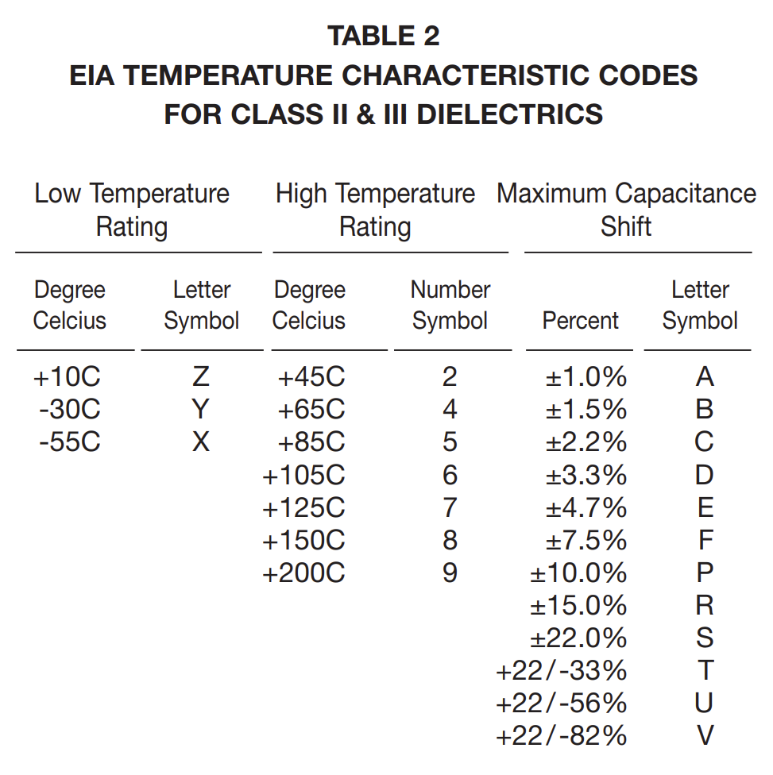

# Ceramic Capacitors
## ESR Frequency Characteristics
[Source](https://article.murata.com/en-global/article/impedance-esr-frequency-characteristics-in-capacitors)

    

In an ideal capacitor, the impedance is: \\( Z = \frac{1}{\omega C} \\). Plotted logarithmically, this looks like:

    

However, when a real-world capacitor is analyzed, we get a different result:

    

*Data from [MCASL168SB5225MTNA01](https://ds.yuden.co.jp/TYCOMPAS/ut/detail?pn=MCASL168SB5225MTNA01&u=M) Capacitor compared with idealized impedance.*

In real-world capacitors, there is some power lost due to dielectric substances (the stuff that goes in between the plates of the capacitor, e.g. ceramic), electrodes (the physical metal plates in a capacitor), among other things. We can accurately approximate all of these losses by saying there is some Equivalent Series Resistance (ESR), that changes with the frequency of the input.

Additionally, there is parasitic inductance at high frequencies, that can be approximated with an Equivalent Series Inductance (ESL). 

Together, along with a resistor in parallel to the capacitor to represent leakage, we have a much more accurate model of how a real-world capacitor operates.

    

Putting the model into practice, we can now explain various parts of the real capacitor's impedance plot.

    

## How to find an ESR value of a capacitor
### ESR as a function of frequency
[Source](https://datasheet.octopart.com/0402ZD105KAT2A-AVX-datasheet-22851.pdf)

The ESR, above all, is an approximation. It is a value that changes with respect to the frequency of the input. The ESR can be calculated by:

$$ \text{ESR} = \frac{\text{D.F.}}{2\pi fC} $$

- \\(\text{D.F.}\\) is the Dissipation Factor. It is often given as a percentage. It could also be given as: \\( \text{D.F.} = \tan (\delta) \\) where \\( \delta\\) is the “Loss angle”
    - \\(f\\) is the frequency in which the value of \\(\delta\\) was measured
- \\(C\\) is the listed capacitance

The "loss angle" is a representation of how inaccurately the capacitor is able to get its desired impedance.

    

When it comes to getting a graphical representation of ESR, it is not reccomended to try and make one up yourself using the formula. Many producers of capacitors have free tools on their websites. You can use them to get a graphical representation of a capacitor's impedance and ESR.

These tools include Murata's [SimSurfing](https://ds.murata.co.jp/simsurfing/index.html?lcid=en-us), KEMET's [K-SIM Capacitor Analysis](https://ksim3.kemet.com/capacitor-simulation), or Samsung Electro-Mechanics' [MLCC Component Library](https://weblib.samsungsem.com/mlcc/mlcc-ec.do). *(MLCC is an abbreviation for Multi-Layer Ceramic Capacitor.)* There are many other tools, by many other names. If you find a part, and want to learn more about it, then digging around on the manufacturer's website for a bit will usually reward you with some way to access the ESR graph directly. It's often tucked under a tab like "Products"/"Components", or one like "Design Analysis Tools". Worst come to worst, you might have to select the capacitor you want on their website and somewhere near it will be a button to "simulate" or "graph" it. 

To use these tools, generally it will require you to select a part(in this case, the capacitor you want to simulate). If it doesn't immediately show you a graph, then somewhere on the page you can select a "graph type" or "frequency characteristic". |Z| (or "Impedance") shows a graph of the capacitor's impedance, R (or "ESR") shows a graph of the capacitor's ESR. 

These are much more precise tools than calculating it oneself, as the frequency a company measures their Dissipation Factor at can vary. You might even be able to find how the capacitance changes with respect to temperature!

### Single ESR value

If there is a single value given to represent the ESR, the frequency of the input is the capacitor's self-resonant frequency. At this point, the impedance of the real capacitor is \\( |Z| = \text{ESR} \\)

This can be seen through a provided plot that shows the ESR value and measured impedance of a capacitor with respect to the input frequency. Notice how they intersect at the self-resonant frequency, the "bottom of the hump":

    

*[MCASL168SB5225MTNA01](https://ds.yuden.co.jp/TYCOMPAS/ut/detail?pn=MCASL168SB5225MTNA01&u=M) Capacitor's impedance compared with ESR.*

LTSpice has a database of capacitors if a single ESR or ESL value is needed. Just create a capacitor, right click it, and click on "Select Capacitor". This might be a good resource if you need to get a value specifically for a Linear Technologies (Analog Devices) part. Otherwise, I would stray away from it. The values they give are often very different from what the manufacturers specify.

## SMD(Surface Mount) Package/Case/Size
[Source](https://www.kadvacorp.com/technology/smd-capacitor-sizes/)

The following is a table of codes standardized by the EIA(Electronic Industries Alliance) regarding package sizes. Not just capacitors can go in these packages.

    

Out of these, the 0603 package size is reccomended as it is relatively easy to solder.

## Temperature Coefficients
[Source](https://content.kemet.com/datasheets/F3101_CerMoldAxRad.pdf). I will also be using [this catalog](https://catalogs.kyocera-avx.com/SurfaceMount.pdf) to provide the occasional example.

### Classes

Temperature coefficients are generally separated by classes. The most common classes are Class I and Class II. Class III does exist, but its use cases are far more narrow.

**Class I:** Great stability with respect to temperature, voltage, frequency, and time (aging). However, Class I capacitors have very low capacitance values.

**Class II:** Available for a much wider range of capacitance values; however, temperature has a greater impact on capacitance. Ideal for bypass or coupling applications. Affected by temperature, voltage, frequency, and time.

**Class III:** Even higher range of capacitance values. Most efficient in terms of space, but worst when it comes to stability. Only use if the stability of capacitance is of little to no value. Could work in a bypass or coupling application.

### C0G(NP0)

The main Class I capacitor still in production is the C0G(NP0).

    

### Class II & III Capacitors

The temperature coefficients of Class II & III capacitors are organized as such:

    

For example, the X5R capacitor will operate from -55 C(**X**) to 85 C(**5**) with a capacitance change of at most ±15%(**R**). This can be seen with the example below:

    

It is important to note that all that is guaranteed with an X5R capacitor is that the % Capacitance stay inside the red box. 

The primary Class III capacitors still in production are Z5U and Y5V.

Here is an example of a Y5V temperature coefficient:

    

