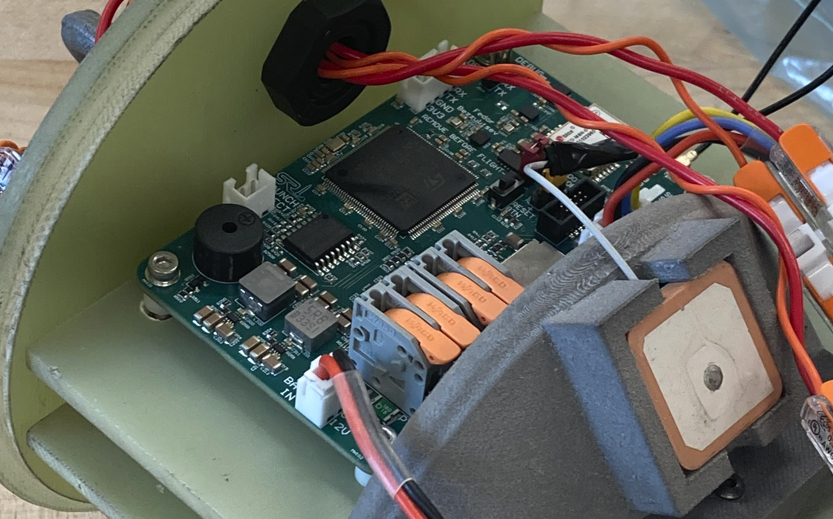

# Mission Statement

The mission of SRL Avionics is to create a reliable avionics system capable of verifying that a rocket has reached space while building a supportive community which develops us as engineers. We welcome members of all skill levels and are dedicated to using rocketry avionics as a way to deepen our technical ability.

## Meeting Time
__Join us every Wednesday at 6:30PM in ECEE 220!__

<!-- Avionics Meetings - Sunday 3:00pm Engineering Lobby (Check Slack avionics channel to make sure the location has not changed for the week)

Software Meetings - Saturday 5:00PM Engineering Lobby

Hardware Meetings - Friday 4:30PM Engineering Lobby -->

## CU Sounding Rocket Laboratory Website Link

- [Avionics Page](https://cusrl.com/avionics/)

## Join the SRL Slack and Notion!

- [Slack Invite Link](https://join.slack.com/t/soundingrocketlab/shared_invite/zt-2n9ciw4h3-sb49brFFkLlJb3Cov8K31A)
- Notion Invite Link - Coming Soon

## Leads

Reach out to leads for any questions you may have!

Alex Reich [alre8317@colorado.edu](mailto:alre8317@colorado.edu)  - Avionics Lead

Pranith Bhat [pranith.bhat@colorado.edu](mailto:pranith.bhat@colorado.edu) - Avionics Controls Lead

Owen White [owen.white@colorado.edu](mailto:owen.white@colorado.edu) - Avionics Embedded Software Lead

Fedor Bezzubtsev [fedor.bezzubtsev@colorado.edu](mailto:fedor.bezzubtsev@colorado.edu) - Avionics Hardware Lead

Landon Holligan [landon.holligan@colorado.edu](mailto:landon.holligan@colorado.edu) - Avionics Structures Lead

