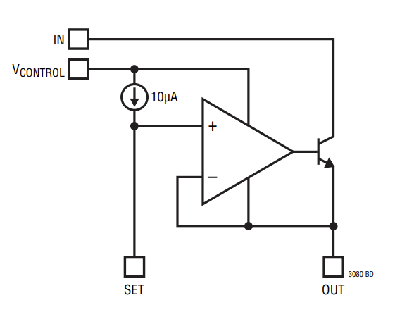
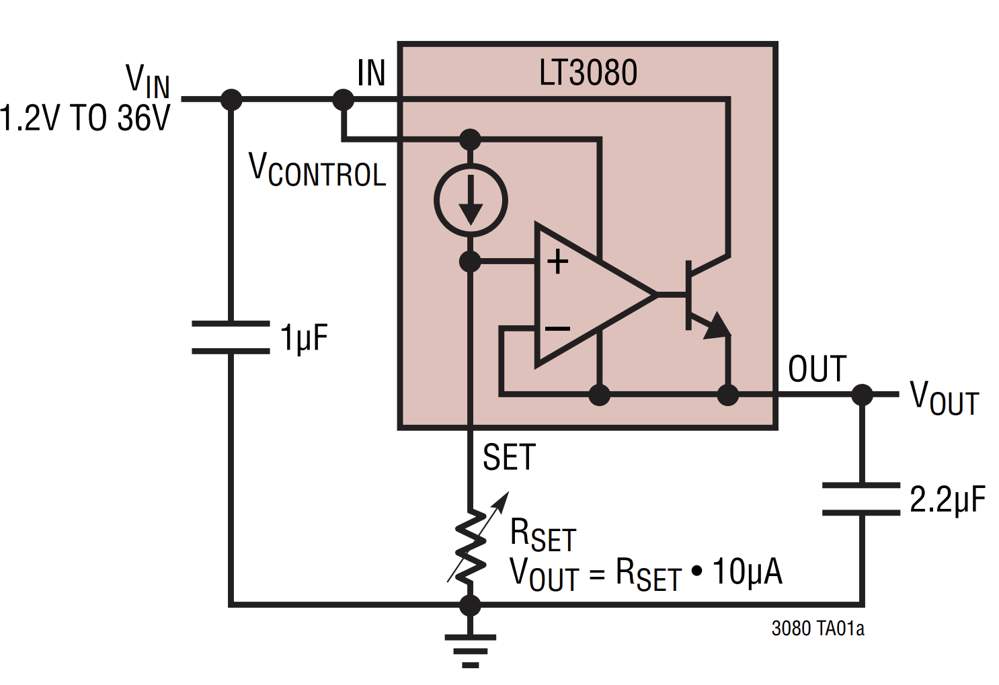

# LDO(LT3080)
[Datasheet](https://www.analog.com/media/en/technical-documentation/data-sheets/3080fc.pdf)

**Goal of Application:** Drop from 4.2 V to a consistent 3.3 V.

***Specific Part:*** 
LT3080EDD#TRPBF 

[https://www.digikey.com/short/hdhdfn83](https://www.digikey.com/short/hdhdfn83)

**Notes**: DD Package, 8-Lead DFN (3mm x 3mm)

**Cost**: $6.40

## Typical Application

## 3.3V Application

$$V_{out} = R_{set} \cdot (10 \times 10^{-6})$$

$$R_{set} = V_{out} \cdot 10 \times 10^{6}$$ 

$$R_{set} = (3.3) \cdot 10^5 = 330 \text{ k} \Omega$$

*Application of LDO in LTSpice.*

## What is an LDO?

- A Low Dropout Regulator(LDO) is a voltage regulator that can get a regulated low output voltage from a higher input voltage.
    - The output is steady, low noise, DC.
    - This is compared to a Linear Voltage Regulator, which requires a higher voltage drop to function as designed.

## LDO Parameters

**Quiescent Current (IQ)** - Current drawn by system when light or no load is connected

**Power Supply Rejection Ratio (PSRR)** - Ability to reject AC elements of source(e.g. ripple voltage). The datasheet of the LT3080 simply calls it "Ripple Rejection".

Defined by: $20\log(\frac{V_{ripple, in}}{V_{ripple,out}})$

Ex: Let $V_{ripple, in}=2 \text V$ & $V_{ripple, out}=0.2 \text V$

$\text{PSRR|}_{dB} = 20\log(\frac{V_{ripple, in}}{V_{ripple,out}}) = 20 \log(\frac{2}{0.2}) = 20 \text{ dB}$

Ex: Let $V_{ripple, in}=2 \text V$ & $V_{ripple, out}= 2 \text {mV}$

$\text{PSRR|}_{dB} = 20\log(\frac{V_{ripple, in}}{V_{ripple,out}}) = 20 \log(\frac{2}{2\times10^{-3}}) = 60 \text{ dB}$

Note: For the PSRR relating to our current application of the part, refer to the "Ripple Rejection, Single Supply" graph. If the $V_{IN}$ and $V_{CONTROL}$ pins are powered by different sources, then refer to the "Ripple Rejection, Dual Supply" graphs.

**Load Regulation** - Ability to maintain specified output voltage under varying load conditions

$\text{Load Regulation} = \frac{\Delta V_{out}}{\Delta I_{out}}$

## Applications Information

- For minimizing board leakage: recommends encircling the SET pin and circuitry with a guard ring operated at a potential close to itself, tied to the OUT pin.

- $V_{IN}$ must be more than 0.1V to 0.5V greater than the output voltage. This depends on the current that needs to flow through the load. For more information, refer to pages 4 and 8 of the datasheet.

- There must be a minimum load current of 1 mA

### OUTPUT CAPACITOR 2.2u

- Capacitor must have an ESR(Equivalent Series Resistance) of 0.5 Ohms or less
    - How to find the ESR of a capacitor is explained [here](/src/avionics/hardware/currentprojects/testingboard/ceramiccapacitors.md)
- Materials with a low ESR include: Ceramic, Tantalum, or low ESR electrolytic

*A Note on Ceramic Capacitors*

- Ceramic capacitors are manufactured with a variety of dielectrics, each with different behavior across temperature and applied voltage
- Most common dielectrics are specified with EIA temperature characteristic codes of: Z5U, Y5V, X5R, X7R
- Z5U, Y5V dielectrics are good for providing high capacitances in a small package, but tend to have strong voltage and temp coefficients
- X7R or X5R are better to use, but be aware of their temperature characteristics
- Try not to find a ceramic capacitor with a piezoelectric response. (It's no requirement, but MIL-STD-202 testing is vibration testing.)

## Additional Purchased Components

**330K Resistor**

ERA-3AEB334V

[https://www.digikey.com/short/nzfdzw40](https://www.digikey.com/short/nzfdzw40)

*Notes: 0.1% Tolerance, 0.1 W Power Rating(This is fine)*

Cost: $0.35

**1u Capacitor**

C0603C105K8PAC7867

[https://www.digikey.com/short/z8pd0t38](https://www.digikey.com/short/z8pd0t38)

*Notes: Tolerance: 10%, Temperature Coefficient: X5R, Rated Voltage: 10V, Package: 0603, ESR: 0.008 Ohms < 0.5 (Source: LTSpice). Normally stocking, RoHS compliant, has datasheet. Has gone through MIL–STD–202 testing. Optionally, you could buy another as a bypass capacitor of the 330k resistor. The LDO’s datasheet claims that would lead to “improvement in transient performance” and reduction of system noise.*

Cost: $0.10

**2.2u Capacitor**

C0603C225K8PAC7867

[https://www.digikey.com/short/4v45dvz4](https://www.digikey.com/short/4v45dvz4)

**Notes: Tolerance: 10%, Temperature Coefficient: X5R, Rated Voltage: 10V, Package: 0603, ESR: 0.017 Ohms < 0.5 (Source: LTSpice). Normally stocking, RoHS compliant, has datasheet. Has gone through MIL–STD–202 testing.*

Cost: $0.23
