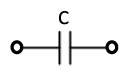
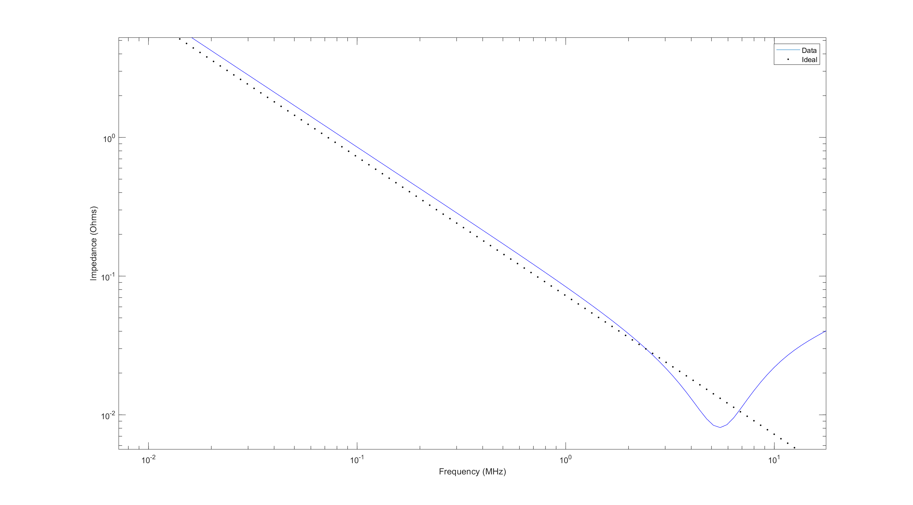
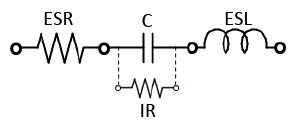
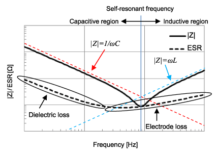
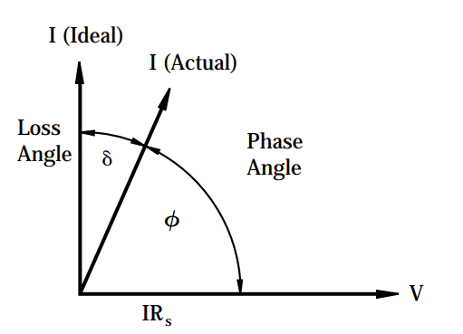
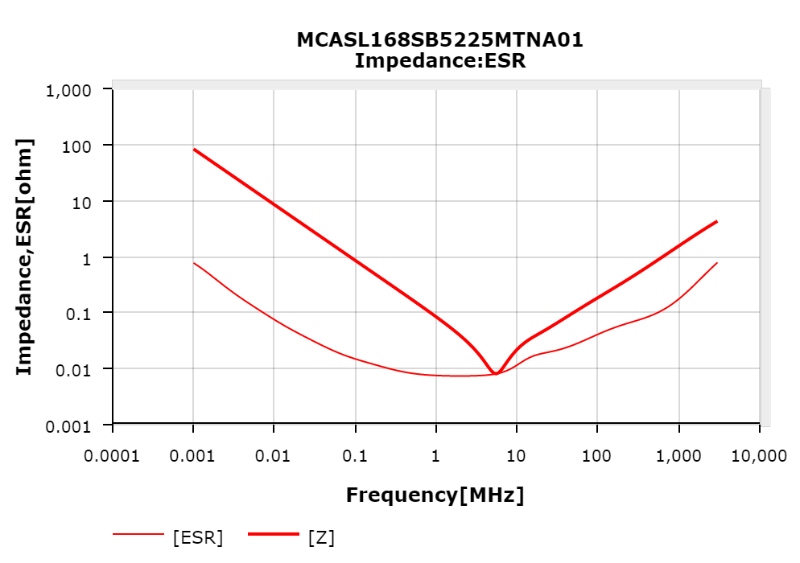
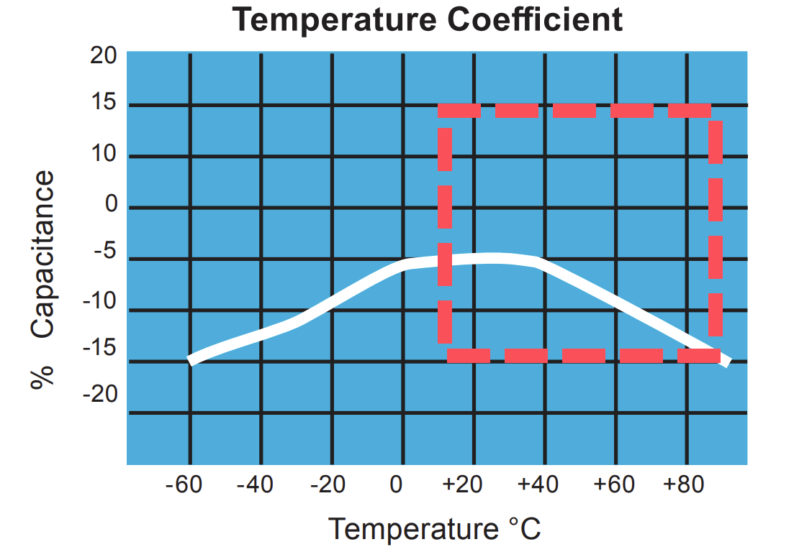

# Ceramic Capacitors
## ESR Frequency Characteristics
[Source](https://article.murata.com/en-global/article/impedance-esr-frequency-characteristics-in-capacitors)

In an ideal capacitor, the impedance is: $Z = \frac{1}{\omega C}$. Plotted logarithmically, this looks like:

However, when a real-world capacitor is analyzed, we get a different result:

*Data from [MCASL168SB5225MTNA01](https://ds.yuden.co.jp/TYCOMPAS/ut/detail?pn=MCASL168SB5225MTNA01&u=M) Capacitor compared with idealized impedance.*

In real-world capacitors, there is some power lost due to dielectric substances (the stuff that goes in between the plates of the capacitor, e.g. ceramic), electrodes (the physical metal plates in a capacitor), among other things. We can accurately approximate all of these losses by saying there is some Equivalent Series Resistance (ESR), that changes with the frequency of the input.

Additionally, there is parasitic inductance at high frequencies, that can be approximated with an Equivalent Series Inductance (ESL). 

Together, along with a resistor in parallel to the capacitor to represent leakage, we have a much more accurate model of how a real-world capacitor operates.

Putting the model into practice, we can now explain various parts of the real capacitor's impedance plot.

## How to find an ESR value of a capacitor
### ESR as a function of frequency
[Source](https://datasheet.octopart.com/0402ZD105KAT2A-AVX-datasheet-22851.pdf)

The ESR, above all, is an approximation. It is a value that changes with respect to the frequency of the input. The ESR can be calculated by:

$$ \text{ESR} = \frac{\text{D.F.}}{2\pi fC} $$

- The Dissipation Factor could also be given as: $\text{D.F.} = \tan (\delta)$ where $\delta$ is the “Loss angle”
    - $f$ is the frequency in which the value of $\delta$ was measured
- $C$ is the listed capacitance

The "loss angle" is a representation of how inaccurately the capacitor is able to get its desired impedance.

### Single ESR value

If there is a single value given to represent the ESR, the frequency of the input is the capacitor's self-resonant frequency. At this point, the impedance of the real capacitor is $|Z| = \text{ESR}$

This can be seen through a provided plot that shows the ESR value and measured impedance of a capacitor with respect to the input frequency. Notice how they intersect at the self-resonant frequency, the "bottom of the hump":

*[MCASL168SB5225MTNA01](https://ds.yuden.co.jp/TYCOMPAS/ut/detail?pn=MCASL168SB5225MTNA01&u=M) Capacitor's impedance compared with ESR.'*

LTSpice has a database of capacitors if a single ESR or ESL value is needed. Just create a capacitor, right click it, and click on "Select Capacitor". 

## SMD(Surface Mount) Capacitor Package/Case/Size
[Source](https://www.kadvacorp.com/technology/smd-capacitor-sizes/)

The following is a table of codes standardized by the EIA(Electronic Industries Alliance) regarding the sizes of capacitors.

Out of these, the 0603 package size is reccomended as it is relatively easy to solder.

## Temperature Coefficients
My source here is [this forum](https://forum.digikey.com/t/understanding-ceramic-capacitor-temp-coefficients/727) that cites the EIA RS-198, the most direct definition of the temperature coefficients. I would try to access the original source, but the library doesn't have it and it costs like $250. So I'm sticking with this. I will also be using [this catalog](https://catalogs.kyocera-avx.com/SurfaceMount.pdf) to provide the occasional example.

### Classes

Temperature coefficients are generally separated by classes. The most common classes are Class I and Class II.

**Class I:** Great stability with respect to temperature; however, very low capacitance values.

**Class II:** Available for a much wider range of capacitance values; however, temperature has a greater impact on capacitance.

### C0G(NP0)

The main Class I capacitor still in production is the C0G(NP0).

### Class II Capacitors

The temperature coefficients of Class II capacitors are organized as such:

For example, the X5R capacitor will operate from 10 C(**Z**) to 85 C(**5**) with a capacitance change of at most ±15%(**R**). This can be seen with the example below:

It is important to note that all that is guaranteed with an X5R capacitor is that the % Capacitance stay inside the red box. 