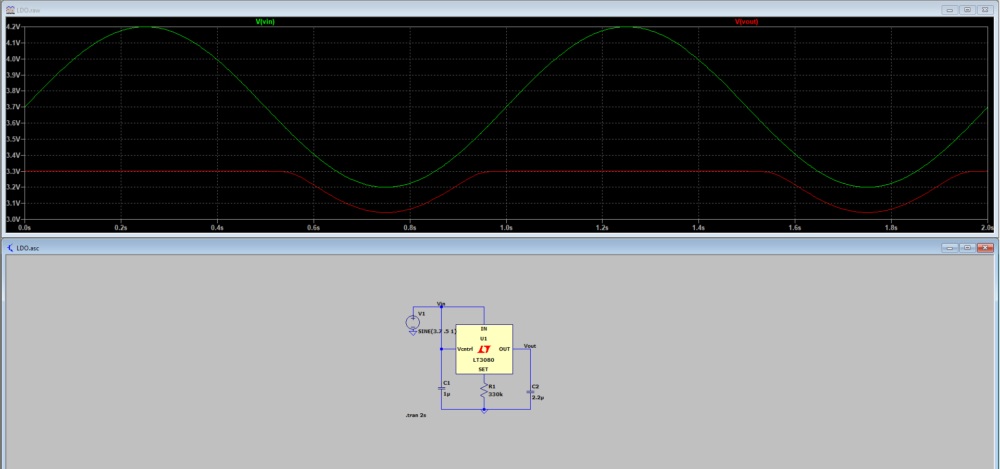
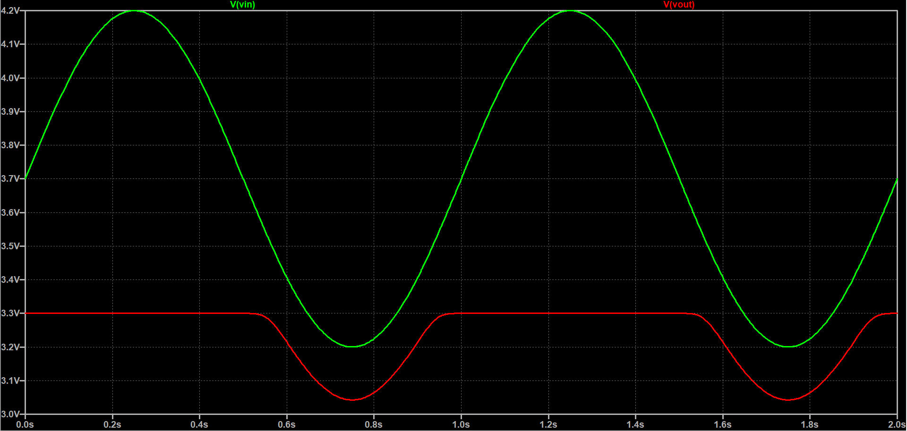
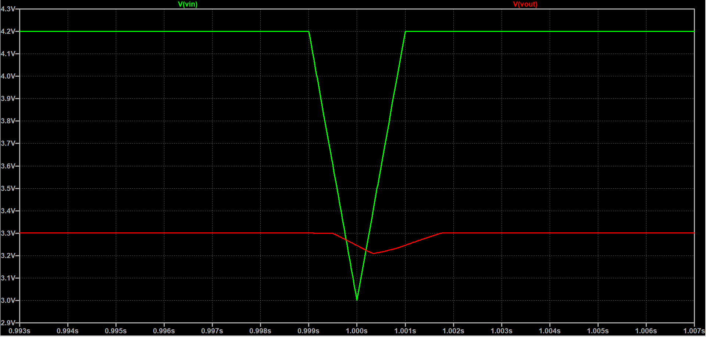

## Relevant Calculations and Simulations for Testing Board

The following simulations are from Ash Tribble. Simulation of the LT3080 part from under-voltage 

Larger picture of graph...

Transient voltage dip (2ms voltage dip)...

