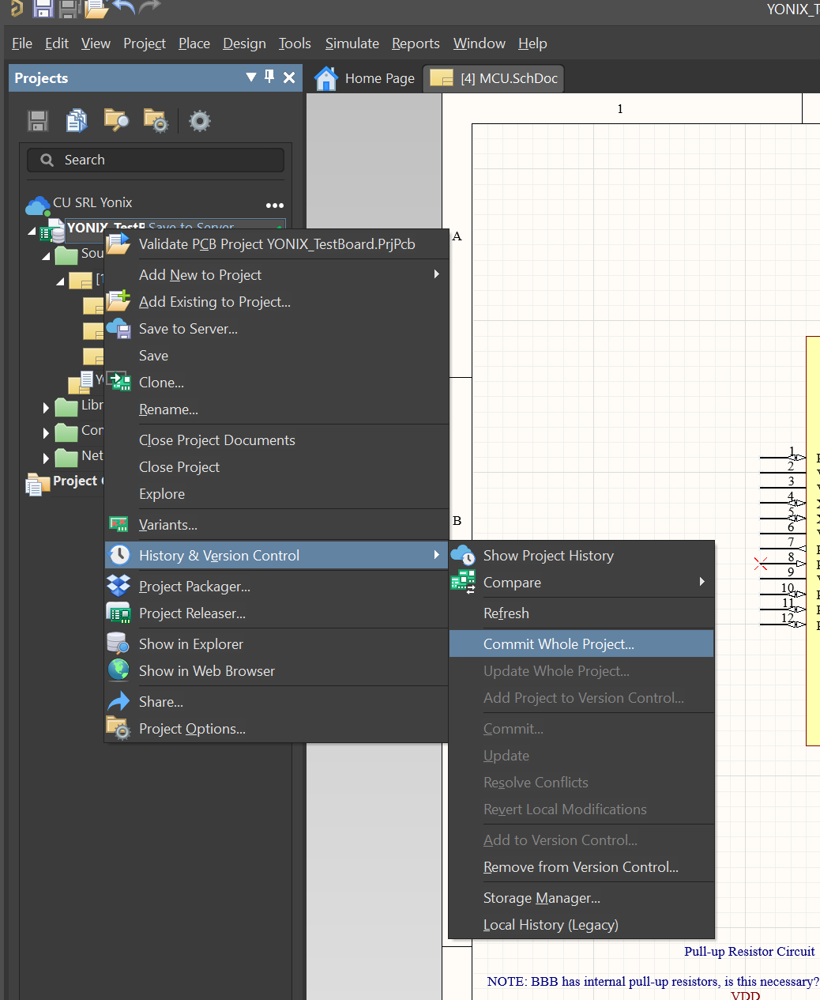

# New Member Set-Up Guide

This is a page dedicated to making it easier for hardware new members to get set-up and ready to develop hardware. 

Here is a list of software that we use regularly:
- Altium Designer - Circuit & PCB design
- LTSpice - IC circuit simulator
- Saleae Logic 2 - Circuit debugging and logic analysis

**Note**: Altium and Saleae Logic both require a Windows OS. 

The majority of this guide will be dedicated to getting set up with our Altium workspace. 

## Getting set up with Altium

First, visit Altium's [Link For Student License](https://www.altium.com/education/student-licenses). This will allow you to get up and running with Altium - the student license allows you to install the software for free.

You will need to verify your email to receive your student license. Once you've received the verification email and clicked the link to verify your email, Altium will send you another email, this time containing your licensing information. You will need to activate your AltiumLive account and sign in to be able to download and use the installers. Once you have downloaded the executable, follow the installation [instructions](https://www.altium.com/documentation/altium-designer/installing) to fully install Altium.

After Altium is installed, send your email to the hardware team lead. They'll add you to the Altium workspace we're using for Avionics. In the meantime, you can follow some Altium tutorials to get familiar with the software, and the PCB design process in general! Here is a very good intro to PCB design that I highly suggest: [Altium Tutorial](https://education.altium.com/courses/). It explains what PCB design is, why we use it, all of the terminology used, and walks through making a simple project to get used to Altium.

Now back to getting setup, once you are added to our Altium workspace, in the top-right corner of your window you should see the workspaces button (it might read "Not Connected"). Click this, and look for "CU SRL Yonix".

If you don't see it, restart Altium. If you still don't see it, contact the avionics hardware lead.

After clicking on CU SRL Yonix, you should see a little blue cloud with CU SRL Yonix right next to it in the projects tab. Right click this and click "Open Project". 

Select the project you'd like to open, and click the "Open" button.

## Download new changes

Whenever Altium first starts up, please **right-click the project name** and, under History & Version Control, click "**Update Whole Project**". This ensures you have any changes other members have uploaded. 

## Adding changes

If you've added work to the Altium document, you'll notice the little green checkmarks next to each file can change to orange or red marks. This indicates there's a pending change to be uploaded. 

To upload your changes to the cloud, right-click the project name and, under version control, click "Commit". 

If any errors come up, please get in touch with hardware lead - Altium's implementation of Git can be hard to work with sometimes. 

## Getting LTSpice

Follow the link to go to [LTSpice Download Link](https://www.analog.com/en/design-center/design-tools-and-calculators/ltspice-simulator.html). This is a useful circuit simulation software. No one in industry will almost ever touch a differential equation because there are so many circuit simulation software things out there. This one is a really good basic circuit simulation software.

## Getting Saleae Logic 2

So an old avionics member named Brendan happened to have like 10 of these cheap knock-off logic analyzers. He donated them all to the avionics team, and we will begin handing these out to people as soon as they are needed when we actually start testing. They work with [Saleae Logic 2](https://www.saleae.com/downloads/) software, which is nice beacuse the software will automatically talk interpret the one's and zero's on a signal line as long as it's not a proprietary communication method. This is really useful to debugging circuits, testing software, and bringing up our boards.

## Some cool resources and guides:

- [Eric Bogatin's Altium Workshop](https://sites.google.com/colorado.edu/practicalpcbdesignmanufacture/erics-altium-workshop)
- [LTSpice Guide](https://www.youtube.com/watch?v=JRcyHuyb1V0&t=581s&ab_channel=FesZElectronics)
- [Saleae User's Guide](http://downloads.saleae.com/Saleae+Users+Guide.pdf)

These are all resources that past hardware leads have used to learn more about the tools in this page. They are all confirmed to be really really interesting. All of the tools we use have excellent documentation and finding more resources or guides on them is really easy (just search it up on google). Feel free to ask questions in the avionics hardware channel for any confusion on these topics, we are all here to help!

