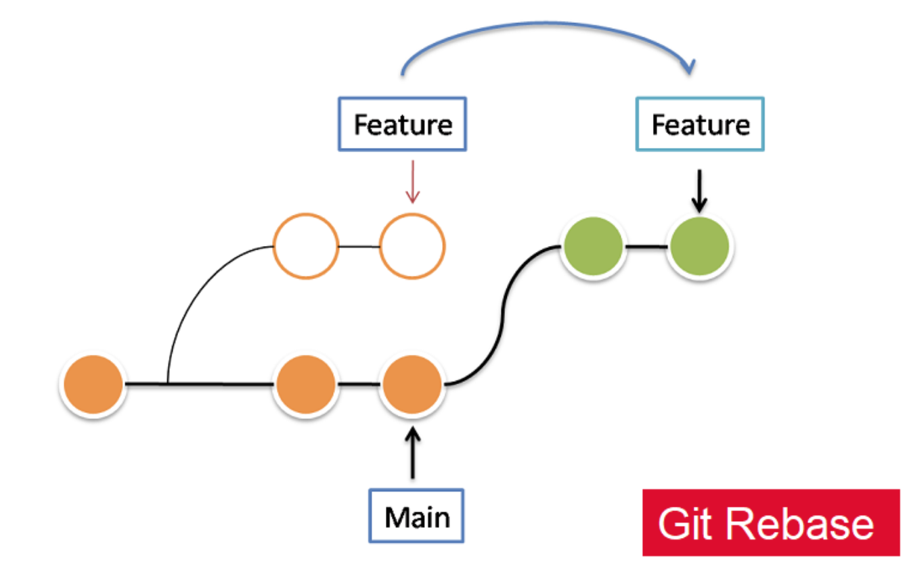

# Git Commands

Once you have the git CLI tool installed, here are some commands that can be useful!

**NOTE: DO NOT PUSH TO MAIN!** If you find yourself typing `git push` and you don't know if you're merging to main or not, reach out to a lead before continuing. We are always willing to help you learn!

1. Cloning a repo

`git clone git@github.com:CU-SRL/<repo_name_here>.git`

This will create a local version of the repository. This is how you will access the actual code in the repo and do any development. You will push and pull code from this directory.

2. Pulling code

`git pull`

This will merge the remote version of the code into your local version.

3. Creating and switching to (or "checking out") a branch

`git checkout -b <branch_name_here>`

This will create a branch with whatever name you choose, and switch you to that branch. The name must not have spaces in it. When you push for the first time, you must let the remote version know that a new branch exists by running

`git push --set-upstream origin <branch_name_here>`

4. Rebasing your branch

This is a more advanced git command. This is typically used before merging a branch to main. After a branch "branches off" from the main branch, other branches might be merged to main. What this means is that when you try to merge your branch back into main, your version will not be updated with the latest changes. Git rebase will make sure your branch includes all of the changes that happened after you created that branch. 

To do this, while on your branch, run

`git rebase main`

There will probably be some merge conflicts. Run `git status` to see which files have conflicts, and then once you have resolved those conflicts run `git add .` and `git rebase --continue`. If you want to cancel the rebase, do `git rebase --abort`.