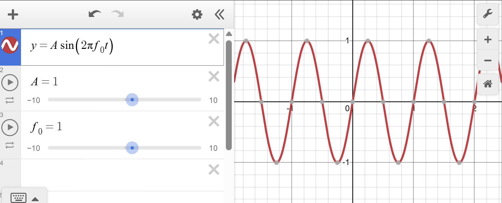
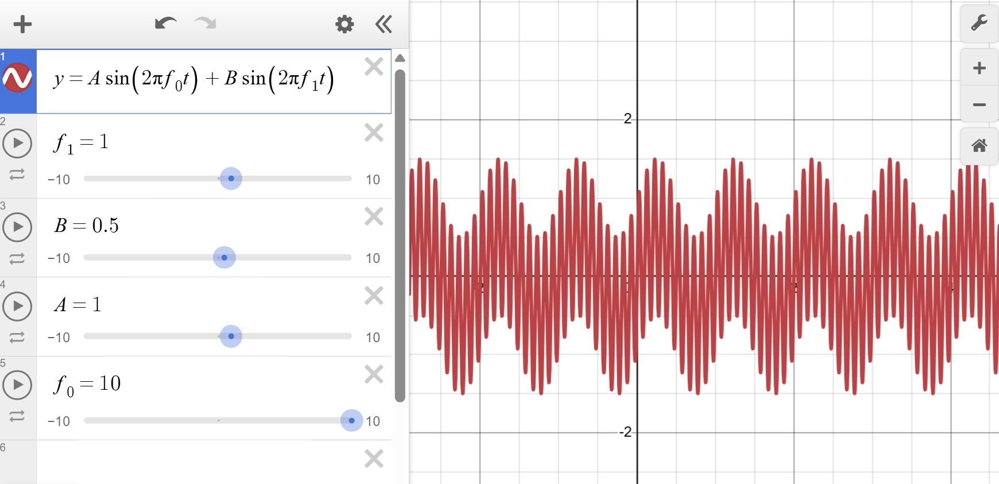

# Basics of RF

## Signals and Fourier Transforms

At its very core, RF communications is about transmitting information from one location to another. The information is transmitted by creating varying electric and magnetic fields, which are able to propagate, but we'll come back to that later. For now, lets talk about how we can turn integers, voice signals, or video streams into these varying fields.

Due to the field propagation mentioned above, RF signals need to be a time-varying AC voltage. The simplest example of this is a sinewave, which can be represented as

$$ x(t) = A\cos(2\pi f_0t + \phi) \tag{1}$$

where $f_0$ is the frequency of the signal, $\phi$ is the phase shift of the signal, and $A$ is the amplitude of the signal. This sinewave looks like this:

    

Changing $A$ will increase or decrease the "height" of the sinewave. Increasing $f_0$ will scrunch the signal together, and decreasing it will spread it out. Lastly, changing $\phi$ will shift the signal back and forth. These three quantities are the levers that we can pull in order to "encode" data into the signal (there are other things too but those are more complicated so we will ignore those for now).

The first and simplest method we will discuss here is **amplitude modulation**, or **AM** for short. If you've ever heard of AM radio, this is exactly what that is. Essentially, we can encode information in the signal by changing it's amplitude over time. The way we do this is by designating a *carrier frequency* which serves as the frequecy who's amplitude will be changed, and adding a *message frequency* which represents the data you are trying to send. In the end, the signal looks something like:

$$ x(t) = A\sin(2\pi f_c t + \phi _c) + B\sin(2\pi f_m + \phi _m) \tag{2}$$

where $B$ is the amplitude of the message frequency, $f_m$ is the message frequency, and $\phi _m$ is the phase of the message frequency. This signal ends up looking like this:

    

This leads us nicely into the idea of...

### The Fourier Transform

Coming soon...

$$ G_{eff} = \eta \frac{4\pi A_0}{\lambda _0^2} $$

$$ \eta_{petals} = e^{-(\frac{2.08 \frac{D}{\lambda}}{N^2})^2} $$

