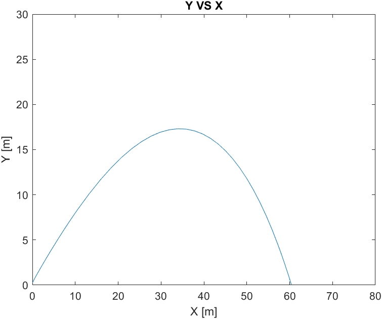

# Editing the docs

Our documentation system is hosted on [GitHub Pages]([GitHub Pages](https://pages.github.com/), and uses Markdown files to show content. 

To edit the documentations, you may either:

1. Clone the git repository these documents are hosted on, and edit using an editor of your choice.
2. Edit the docs directly on GitHub, and commit your changes there. 

If you're going to be doing a lot of editing, we recommend the first option.

## Cloning the repository

First, you must be added to the [Github SRL organization](https://github.com/CU-SRL). Get in touch with a team leader to do this. 

Next, clone the repository. 

For first-time Git users, we recommend you use [GitHub Desktop](https://desktop.github.com/), with an editor of your choice (such as [Visual Studio Code](https://code.visualstudio.com/)).

For command line users, or those who want to familiarize themselves with git, use the following command in a folder of your choice:

```bash
git clone git@github.com:CU-SRL/docs.git
```

then open the documentation in an editor.

## Working with the documentation

The documentation root looks like this. 

```
book/           The theme and styling of the website itself.
src/            The folder containing site content.
book.toml       Backend parameters for the site generator.
```

Most of the work you'll be doing will be inside the `src/` folder. 

### Structure

The documentation inside the `src/` folder is structured as shown below.  

```
SUMMARY.md
avionics/
- currentprojects/
    - currentprojects.md
    - testboard.md
- overview/
    - images/
    - overview.md
    - ...
- gettinginvolved.md
```

All pages are Markdown (`.md`) files.

Section headings are folders. Inside each folder, you might find some subheadings. If you want a subheading to be clickable, create that subheading inside its folder (such as `overview/overview.md`). 

We recommend you explore a bit and get familiarized. 

### Adding a page

First, create the `.md` file for the page you want to create.

Then, create a link to that Markdown file inside the `SUMMARY.md` file. Look inside `SUMMARY.md` for examples.

### Working with Markdown

GitHub has good documentation on working with Markdown, [available here](https://docs.github.com/en/get-started/writing-on-github/getting-started-with-writing-and-formatting-on-github/basic-writing-and-formatting-syntax). 

### Working with images

To add an image to a page, create an `images/` folder if it does not already exist, in the same directory as the page you want to add an image to. Copy the image to that images folder.

Then, inside the `.md` file, use [Markdown image syntax](https://docs.github.com/en/get-started/writing-on-github/getting-started-with-writing-and-formatting-on-github/basic-writing-and-formatting-syntax#images) to link to it. Links are relative, so use `images/your-image.png` for the link. 

If you want to resize your image, use the following syntax instead:

```html

```



## Uploading changes

Using [GitHub Desktop](https://desktop.github.com/), simply add a change summary, commit, then push to the `main` branch.

Using command-line git, navigate to the repository folder, then

```bash
git add .
git commit -m "<change description>"
git push origin main
```